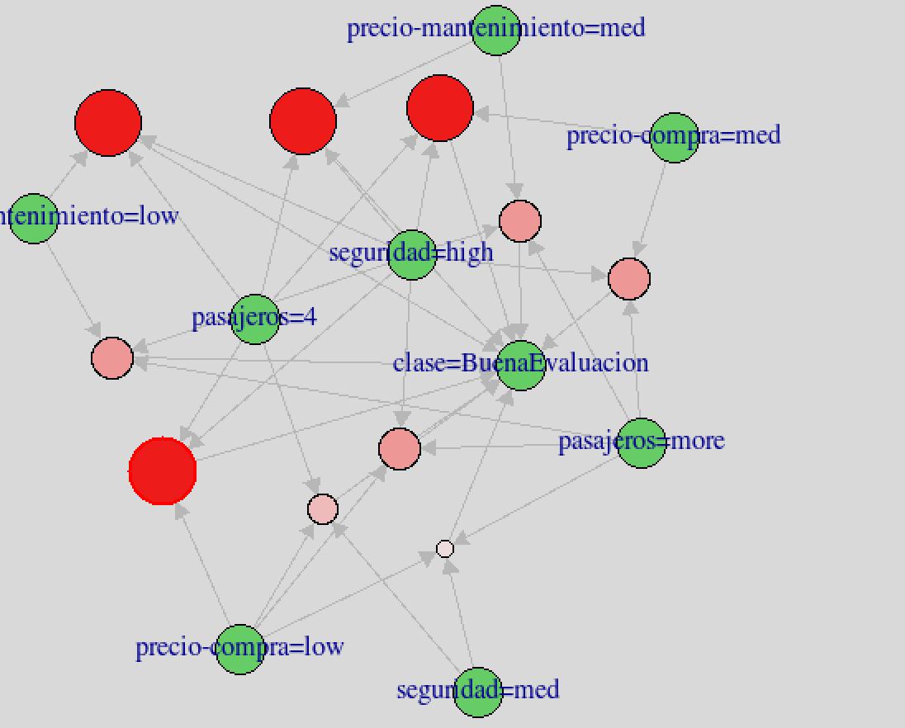

## 1 Introducción al dataset

Para la práctica de reglas de asociación de la asignatura **"Minería de Datos: Detección de Anomálias y  Aprendizaje no Supervisado"** se ha utilizado un dataset recuperado de la web de UCI que tiene ciertas características de coches y trata de evaluar los mismos en función de factores como su comodidad.

El dataset puede encontrarse en el siguiente enlace: https://archive.ics.uci.edu/ml/datasets/Car+Evaluation

Leemos los datos y construimos un dataframe, ya que estos vienen separados en data y names. 

```{r}
car<-read.table("data/car.data", sep = ",")
names(car)<-c("precio-compra","precio-mantenimiento","puertas",
              "pasajeros", "maletero", "seguridad", "clase")
```

## 2 Análisis exploratorio

Vamos a comprobar si tenemos datos completos en los datos, ya que los valores perdidos siempre pueden causar problemas. 

```{r}
sum(is.na(car))
```

Vemos que no hay valores perdidos por lo que el siguiente paso será ver de que tipo son nuestros datos, así como sus distribuciones para comenzar a hacernos una idea de que es lo que tenemos entre manos. 

```{r}
str(car)
```


Parece que todos son factores, por lo que no tendremos variables numéricas que partir en rangos que puedan ser caracterizados.

```{r}
library(Hmisc)
describe(car)
```

Respecto a las distribuciones, vemos que salvo la clase, final, donde tenemos mas coches catalogados como malos que buenos, todas las demás variables se distribuyen de manera homogénea y no balanceda. Esto nos beneficiará en el proceso de minado de reglas de asociación ya que tendremos representaciones homogéneas de los ítems. Dicho esto, estamos en posición de comenzar nuestro estudio de reglas de asociación e itemsets frecuentes.  


## 3 Paso a base de datos transaccional

Para el proceso de obtención de reglas de asociación, la base de datos debe ser transaccional. Nuestro dataset, según lo estudiado en el punto anterior se presta a ello de manera fácil, por lo que no tendremos que preparar mucho los datos. 

```{r}
library(arules)
car.transactions <- as(car, "transactions")
summary(car.transactions)
```


## 4 Itemsets

En esta sección usaremos las transacciones de nuestro dataset para realizar un análisis de los itemsets. Para ello, nos centraremos en los **itemsets frecuentes, maximales y cerrados**. 

El pauquete **arules** tiene una función muy útil que nos permite ver la distribución de ítems-frecuentes de manera gráfica para un valor determinado de soporte mínimo. 

```{r}
itemFrequencyPlot(car.transactions, support = 0.1, cex.names=0.8)
```

Si analizamos el anterior gráfico, podemos comprobar como solo **clase=unacc**, está presente en más de la mitad de las transacciones. Por otro lado, las demás variables se mantienen estables lo que gráficamente nos induce a pensar que es un dataset bastante artificial o confeccionado a conciencia para tener estas frecuencias de ítems. Cabe remarcar que no hay presencia de los ítems **clase=good** o **clase=vgood**, que a muy seguro tendrán valores de soporte menor de 0.1. Dado que estos ítems son muy interesantes para obtener información del problema, ya podemos remarcar que el valor de soporte para la obtención de las reglas deberá ser menor de 0.1. Vamos a comprobar que esta premisa es así, representando el mismo gráfico pero con menos soporte. 

```{r}
itemFrequencyPlot(car.transactions, support = 0.01, cex.names=0.8)
```


En el anterior gráfico podemos apreciar como han aparecido dos nuevas columnas, que reprentan los ítems **clase=good** y **clase=vgood** lo que nos lleva a concluir por tanto que los valores de soporte de estos ítems en función al resto son muy bajos, algo que los convierte en muy interesantes y dignos de estudio ya que además resentan a dos clases aceptables del problema.

Vamos a obtener el algoritmo **apriori**, para obtener los itemsets frecuentes y analizarlos con más detalle atendiendo a sus medidas. 

```{r}
iCar <- apriori(car.transactions, parameter = list(support = 0.01, target="frequent", minlen=1))
#Ordenamos los ítems por soporte descendente
iCar <- sort(iCar, by="support")
```

Hemos generado un total de 2291 itemsets frecuentes. Vamos a ver cuales son estos, usando el comando **inspect**.

```{r}
#Inspeccionamos los 100 primeros
inspect(head(iCar, n=50))
```

Si nos centraramos solo en los ítemsets frecuentes, ya podríamos obtener información relevante del dataset e incluso hacer algunas "predicciones" en un hipotético caso de toma de decisiones, como por ejemplo el set de ítems *[29]  {precio-compra=vhigh,clase=unacc} * en contra de lo que podríamos llegar a pensar aparecen bastantes veces en el dataset que si el precio de compra es muy caro, la clase será la peor, por lo que ya podríamos casi asegurar que con mucha probabilidad que un coche sea evaluado como bueno o malo vendrá dado por otros motivos en lugar de un precio caro.

Otro set de ítems interesantes, podría ser el *[12]  {pasajeros=2,clase=unacc}*, aquí estamos claramente frente a coches deportivos de dos plazas que en un  gran número de casos, son asignados a la peor clase, por lo que esto nos deja saber que probablemente lo que tenemos entre manos son evaluaciones que nada tienen que ver con lujos o grandes motores sino con coches serviciales y destinados al uso diario. 

Si quisieramos acotar y seguir analizando los ítemsets frecuentes, podríamos usar rangos definidos por las variables **minlen** y **maxlen** para definir cuantos ítems queremos que formen los sets. 

```{r}
iCar <- apriori(car.transactions, parameter = list(support = 0.01, 
                                                   target="frequent", 
                                                   minlen=2, 
                                                   maxlen=4))
#Ordenamos los ítems por soporte descendente
iCar <- sort(iCar, by="support")
#Mostramos a modo de ejemplo los 20 primeros
inspect(head(iCar, n=20))
```

Estos parámetros anteriores pueden ser muy útiles en grandes conjuntos de datos donde la explosión de itemsets sea muy grande. En nuestro caso, dejaremos los parámetros por defecto dado que a simple vista podemos manejarlos todos sin muchas complicaciones. Obtendremos por tanto los de todos los tamaños y crearemos un gráfico de barras para ver su distribución.

```{r}
iCar <- apriori(car.transactions, parameter = list(support = 0.01, target="frequent"))
barplot(table(size(iCar)), xlab="itemset size", ylab="count")
```


En el anterior gráfico podemos ver como la mayor parte de los ítemsets frecuentes son de tamaño 3 y 4, por lo que todo apunta a que podremos obtener buenas reglas y de un tamaño aceptable para sacar conclusiones en nuestro proceso de evaluación de coches. 

En esta caso, los ítems no son muchos, por lo que podríamos quedarnos con ellos sin problema. Por otro lado, en caso de tener una set de ítems mayor, podríamos usar los ítems maximales o cerrados. Para obtener estos, el paquete apriori nos ofrece funciones fáciles de usar como sigue:

* **Maximales**:

```{r}
imaxCar <- iCar[is.maximal(iCar)]
imaxCar
inspect(head(sort(imaxCar, by="support")))
```


* **Cerrados**:

```{r}
icloCar <- iCar[is.closed(iCar)]
icloCar
inspect(head(sort(icloCar, by="support")))
```


Una vez obtenidos todos, vamos a representar con un gráfico el número de ítems de cada clase:

```{r}
barplot( c(frequent=length(iCar), closed=length(icloCar), 
           maximal=length(imaxCar)), ylab="count", xlab="itemsets")
```

El gráfico muestra lo que según la teoría cabe esperar y es que los maximales, son los menos abundantes, frente a cerrados y frecuentes que siempre se dan de la mano, aunque siempre son estos segundos algo más abundantes en el dominio del problema. 

Dado que tenemos todos estos conjuntos vamos a comprobar las premisas de eficiencia que instan a usar unos u otros, que en casi todos los casos se traducen en reducción del espacio que ocupan. Por ello, vamos a obtener los tamaños de cada uno de los objetos. 


```{r}
object.size(iCar)
object.size(icloCar)
object.size(imaxCar)
```

En este caso, los tamaños son insignificantes, pero si extrapolaramos los datos a un problema real, que incluso pudiera ser catalogado como Big Data, tener una representación que nos permitiera ahorrar espacio de casi un 50%, (como es el caso de los ítems maximales en nuestro problema), seguramente los beneficios fuerán mayores y necesarios de tener en cuenta. 

## 5 Reglas de asociación

En este punto usaremos el método apriori para obtener las reglas de asociación. Esta es la parte esencial de la práctica y trataremos de evaluar cuando un coche es bueno y cuando es malo mediante estos métodos. 


```{r}
rules <- apriori(car, parameter = list(support = 0.01, confidence = 0.8, minlen = 2))
rules
```


Hemos obtenido 415 reglas de asociación, por lo que al no ser muchas, podremos estudiarlas sin mucha complejidad. Aún así, antes de entrar en el análisis vamos a eliminar las reglas redundantes, para no caer en el error de analizar dos veces la misma regla. 


```{r}
rulesSorted = sort(rules, by = "confidence")
subsetMatrix <- is.subset(rulesSorted, rulesSorted)
subsetMatrix[lower.tri(subsetMatrix, diag=TRUE)] <- FALSE
redundant <- colSums(subsetMatrix, na.rm=TRUE) >= 1
rulesPruned <- rulesSorted[!redundant] 
rulesPruned
```

Reglas no redundantes, aparecen solo 38. Esto ha simplificado el problema aún más, tanto que incluso podríamos llegar a pensar que el dataset no es apropiado ya que no ofrece muchas caracteristicas descriptivas. 

Antes de entrar en el análisis de las reglas, en un dominio donde el número de estas sea muy abundante puede ser de especial utilidad obtener visualmente información sobre el número de reglas y la bondaz de las mismas. Para ello, podemos apoyarnos en gráficos:

```{r}
library(arulesViz)
plot(rulesPruned, method="two-key plot")
```


En este gráfico, podemos ver las reglas obtenidas, el tamaño de las mismas y como se situan en función del soporte y la confianza. Algo muy util incluso para ver ciertos patrones, como por ejemplo, comprobar como las reglas de mayor número de ítems se situan con valores menores de soporte. Una vez vista la distribucion de las reglas obtenidas vamos a inspeccionarlas manualmente:

```{r}
inspect(rulesPruned)
```

Si analizamos las relglas obtenidas, parece que hemos tenido un claro sesgo hacia nuestra clase mayoritaria y obtenemos reglas aceptables que nos llevan a saber cuando un coche no es apropiado. Deberemos afinar un poco más el proceso de obtención de reglas para obtener informacion que realmente aporte valor. Esto podrá hacerse probablemente, realizando un estudio basado en generalización o jerarquización de reglas. 

Aún así, aunque este set de reglas no nos ayuda mucho con nuestra premisa inicial de ver cuando un coche será evaluado como bueno, sí que nos ayuda para obtener información acerca de cuando un determinado vehiculo tendrá evaluación negativa, ademas de darnos información curiosa aunque ciertamente trivial como la regla * [1] {clase=vgood} => {seguridad=high} * que nos indica que si la evaluación del vehículo es muy buena, la seguridad será muy alta. Por otro lado, volvemos a tener un claro ejemplo en como los coches 'deportivos' serán evaluados como malos en este problema, ya que tenemos reglas del tipo *[16]{precio-compra=vhigh,puertas=2,maletero=small}  => {clase=unacc}*, donde ahora sin ningun tipo de duda estamos ante este tipo de coches, precios altos, 2 puertas y maleteros pequeños implicarán clases malas.

Dado que lo que nos interesa es ver cuando será una evaluaciona aceptable y cuando no, en los próximos puntos realizaremos un análisis más exhaustivo para intentar obtener aún mejor información y representarla graficamente.  

## 7 Enfoques avanzados

### 7.1 Reglas generalizadas o gerarquicas

Dado que los resultados vistos anteriormente no son muy buenos, se nos presenta la posibilidad de hacer las siguientes generalizaciones para ver si obtenemos mejores resultados:

*Clase=unacc -> Clase=MalaEvaluacion

*Clase=acc, Clase=good y Clase=vgood -> Clase=BuenaEvaluacion

Para realizar este paso, primero copiaremos en dataset (para evitar modificar el original), cambiaremos estos valores y tras ello obtendremos de nuevo las reglas. 

```{r}
cargeneralizazo<-car
cargeneralizazo$clase<-ifelse(cargeneralizazo$clase=="unacc","MalaEvaluacion","BuenaEvaluacion")
cargeneralizazo$clase<-as.factor(cargeneralizazo$clase)
head(cargeneralizazo,5)
```

Una vez hecho el cambio, obtendremos nuestras transacciones y reglas de asociación.


```{r}
cargeneralizazo.transactions <- as(cargeneralizazo, "transactions")

rules.generalizadas <- apriori(cargeneralizazo.transactions, 
                               parameter = list(support = 0.01, confidence = 0.8, minlen = 2))
rules.generalizadas
```

Parece que obtenemos alguna reglas más que anterioremente. Vamos a filtrarlas por no redundantes e intentar obtener información de ellas. 

```{r}
rulesSorted = sort(rules.generalizadas, by = "confidence")
subsetMatrix <- is.subset(rulesSorted, rulesSorted)
subsetMatrix[lower.tri(subsetMatrix, diag=TRUE)] <- FALSE
redundant <- colSums(subsetMatrix, na.rm=TRUE) >= 1
rulesPruned <- rulesSorted[!redundant] 
inspect(rulesPruned)
```

Parece que nuestro proceso de generalización de reglas ha surtido efecto y tenemos ya presencia de clase=BuenaEvaluacion en los consecuentes, que es la premisa que buscamos, es decir, ver cuando un coche será bien evaluado en función de sus características. Una función interesante para evaluar las reglas estará también en encontrar aquellas que están relacioandas con determinados ítems. Por ejemplo vamos a construir dos sets de reglas, uno para los de la clase MalaEvaluación y otro para los de la clase BuenaEvaluación.


```{r}
rules.malaeval<- apriori (cargeneralizazo, parameter=list(supp=0.01,conf = 0.8), 
                          appearance =list (default="lhs",rhs="clase=MalaEvaluacion"), 
                          control = list (verbose=F))

rules.buenaeval<- apriori (cargeneralizazo, parameter=list(supp=0.01,conf = 0.8),
                           appearance =list (default="lhs",rhs="clase=BuenaEvaluacion"), 
                           control = list (verbose=F))
```

Ahora limpiaremos los sets de reglas redundantes. 

```{r}
#Mala evaluación
rulesSorted = sort(rules.malaeval, by = "confidence")
subsetMatrix <- is.subset(rulesSorted, rulesSorted)
subsetMatrix[lower.tri(subsetMatrix, diag=TRUE)] <- FALSE
redundant <- colSums(subsetMatrix, na.rm=TRUE) >= 1
rulesPrunedMala <- rulesSorted[!redundant] 

#Buena evaluación

rulesSorted = sort(rules.buenaeval, by = "confidence")
subsetMatrix <- is.subset(rulesSorted, rulesSorted)
subsetMatrix[lower.tri(subsetMatrix, diag=TRUE)] <- FALSE
redundant <- colSums(subsetMatrix, na.rm=TRUE) >= 1
rulesPrunedBuena <- rulesSorted[!redundant] 
```

Por último, mostramos las reglas y las estudiamos:

```{r}
inspect(rulesPrunedBuena)
```

Parece que nuestro proceso ha tenido utilidad y tenemos un buen set de reglas con valores bastante aceptables de medidas de bondaz. Vamos a estudiar algunas reglas interesantes: 

* *[16] {pasajeros=more,maletero=big,seguridad=high} => {clase=BuenaEvaluacion}*  
* *[17] {pasajeros=more,maletero=big,seguridad=med}  => {clase=BuenaEvaluacion}*
* *[18] {pasajeros=more,maletero=med,seguridad=high} => {clase=BuenaEvaluacion}* 

Estas tres reglas, confirman la teoria que teníamos anteriormente de que en el proceso de evaluación se están teniendo en cuenta coches serviciales frente a coches lujosos, bonitos o rápidos. Al estudiar las reglas anteriores, es evidente, que estamos ante *coches familiares o del tipo monovolumen* y los cuales son bastante bien valorados a pesar de que otros factores como el tamaño o la seguridad pueda tomar valores dispares. 

Otra regla interesante, puede ser la *[15]{pasajeros=4,maletero=big,seguridad=med} => {clase=BuenaEvaluacion}*, donde vemos como la evaluación de un hipotético coche se permite descensos en seguridad pos de mayor tamaño. 

Por otro lado, hay también reglas triviales que no nos dicen nada como pueden ser  *[1]{precio-compra=low,pasajeros=4,seguridad=high} => {clase=BuenaEvaluacion}* y  *[3]{precio-mantenimiento=low,pasajeros=4,seguridad=high} => {clase=BuenaEvaluacion}* donde podemos corroborar la típica expresión popular del "bueno, bonito y barato", pero que no aporta valor ninguno. 

También, puede obtenerse información por ausencia de reglas, es decir, podemos ver que no hay ninguna regla cuyo antecedente contenga el ítem **seguridad=low**, por lo que a muy seguro, este sea un ítem que determinará en la mayoría de los casos una mala evaluación. Para comprobar esta premisa, por último, vamos a estudiar las reglas para **clase=MalaEvaluacion**.

```{r}
inspect(rulesPrunedMala)
```

De primeras podemos comprobar la hipótesis planteada anteriormente, ya que la priemera regla obtenida nos indica que  *{seguridad=low} => {clase=MalaEvaluacion}*, en un gran número de los casos. 

También es interesante como **puertas=2** parece ser el factor predominante en las reglas que causen mala evaluación por lo que esta información podría ser utilizada por ejemplo en una compañia automovilística que fuera a lanzar un nuevo coche en un determinado sector y sabría que la evaluación que los usarios harán de el, aunque los tamaños sean del coche en sí talla media-grande, será con mucha probabilidad mala si no se remedia el factor de las puertas. 


Aunque, como hemos podido comprobar, las reglas de asociación son muy descriptivas y fácilmente entendibles, en algunos casos puede ser complicado obtener información de las mismas, por lo que usaremos gráficos para ver si podemos obtener o representar de una manera más amable los resultados.

```{r}
plot(rulesPrunedBuena[1:10], method="graph")
```

Este gráfico se representa de manera poco útil debido al solapamient de los nodos, hubs y aristas. Por ello deberemos utilizar la opción engine=interactive, donde podremos mover los nodos y las artistas del gráfico a nuestra manera obteniendo una mejor representación como puede ser:



A modo de ejemplo, en este gráfico podemos ver como si pasajeros=more, seuridad=med y precio-compra=low, entonces, la clase será buena. 

### 7.2 Ítems negados y Análisis por grupos

Por último realizaremos un estudio de ítems negados y análisis por grupos. Para ello, tendremos que negar los ítems de nuestra base de datos en una especie de dummificación, por lo que podremos usar el paquete dummies para facilitar el proceso y construir nuestro dataset. Dado que la explosión de ítems puede ser muy elevada, solo lo realizaremos con dos variables, seguridad y puertas. 

```{r}
library(dummies)
puertas<-dummy(cargeneralizazo$puertas)
seguridad<-dummy(cargeneralizazo$seguridad)
#Creamos el dataset
negados<-cbind("precio-compra"=as.character(cargeneralizazo$`precio-compra`), 
               "precio-mantenimiento"=as.character(cargeneralizazo$`precio-mantenimiento`),
               puertas, "pasajeros"=as.character(cargeneralizazo$pasajeros),
               "maletero"=as.character(cargeneralizazo$maletero), seguridad, 
               "clase"=as.character(cargeneralizazo$clase))
negados<-as.data.frame(negados)
```

Ahora tendremos que pasar los 1 y los 0 de las variables creadas a true o false tras lo cual, obtendremos los datos en un dataframe de factores para que las transacciones puedan obtenerse de manera correcta.

```{r}
negados[,c(3:6,9:11)]<-ifelse(negados[,c(3:6,9:11)]==1,TRUE,FALSE)
#Por último pasamos a factor los datos y obtenemos las transacciones
negados<-apply(negados, 2, as.factor)
negados<-as.data.frame(negados)
str(negados)
```


Obtenemos las reglas de asociación (aumentando un poco el soporte, ya que de otro modo el número de estas es muy grande) y las limpiamos ya que ahora puede haber una gran representación de reglas que tengan el mismo significado. 


```{r}
negados <- as(negados, "transactions")
rules.negadas <- apriori(negados, parameter = list(support = 0.03, 
                                                  confidence = 0.8, 
                                                  minlen = 2))
rules.negadas
```

Vemos como el número de reglas si que se ha disparado en este caso, obteniendo un total de 18858 reglas. Vamos a limpiarlas para no perder el tiempo con reglas similares. 

```{r}
rulesSortedNegadas = sort(rules.negadas, by = "confidence")
subsetMatrix <- is.subset(rulesSortedNegadas, rulesSortedNegadas)
subsetMatrix[lower.tri(subsetMatrix, diag=TRUE)] <- FALSE
redundant <- colSums(subsetMatrix, na.rm=TRUE) >= 1
rulesPrunedNegadas <- rulesSortedNegadas[!redundant] 
rulesPrunedNegadas
```

Dado que nuevamente, tenemos set de reglas de tamaño suficientemente grande como para no poder ser analizadas todas manualmente, obtendremos solo aquellas con las clases en los consecuentes, ya que de otro modo, hay muchas reglas que meten ruido y no son para nada interesantes como estas*{puertas4= TRUE} => {puertas2=FALSE}*, *{puertas4= TRUE}=>{puertas5more=FALSE}*, *{puertas4= TRUE} => {puertas3=FALSE}*  y las demás combinaciones posibles de reglas de este tipo. 

```{r}
rules.malaeval.negados<- apriori(negados, parameter=list(supp=0.03,conf = 0.8), 
                          appearance =list (default="lhs",rhs="clase=MalaEvaluacion"), 
                          control = list (verbose=F))

rules.buenaeval.negados<- apriori(negados, parameter=list(supp=0.03,conf = 0.8),
                           appearance =list (default="lhs",rhs="clase=BuenaEvaluacion"), 
                           control = list (verbose=F))

#Mala evaluación
rulesSorted = sort(rules.malaeval.negados, by = "confidence")
subsetMatrix <- is.subset(rulesSorted, rulesSorted)
subsetMatrix[lower.tri(subsetMatrix, diag=TRUE)] <- FALSE
redundant <- colSums(subsetMatrix, na.rm=TRUE) >= 1
rulesPrunedMalaNegados <- rulesSorted[!redundant] 
rulesPrunedMalaNegados
#Buena evaluación

rulesSorted = sort(rules.buenaeval.negados, by = "confidence")
subsetMatrix <- is.subset(rulesSorted, rulesSorted)
subsetMatrix[lower.tri(subsetMatrix, diag=TRUE)] <- FALSE
redundant <- colSums(subsetMatrix, na.rm=TRUE) >= 1
rulesPrunedBuenaNegados <- rulesSorted[!redundant] 
rulesPrunedBuenaNegados
```

Por último, analizamos las reglas:

```{r}
inspect(rulesPrunedBuenaNegados)
```

Básicamente todas las reglas que tenemos entre manos tienen ítems negados que corresponden a **seguridadlow=FALSE**, algo que era de esperar. Por otro lado, podemos comprobar la potencia de este método en reglas como **{puertas2=FALSE,puertas3=FALSE,pasajeros=4,maletero=med,seguridadlow=FALSE} => {clase=BuenaEvaluacion}** donde gracias a los ítems negados en una sola regla podemos deducir 4 reglas interesantes que serían:

* *{puertas=4,pasajeros=4,maletero=med,seguridad=med} => {clase=BuenaEvaluacion}*
* *{puertas=4,pasajeros=4,maletero=med,seguridad=high} => {clase=BuenaEvaluacion}*
* *{puertas=5more,pasajeros=4,maletero=med,seguridad=med} => {clase=BuenaEvaluacion}*
* *{puertas=5more,pasajeros=4,maletero=med,seguridad=high} => {clase=BuenaEvaluacion}*


```{r}
inspect(head(rulesPrunedMalaNegados,10))
```

Al inspeccionar estas reglas, nos encontramos con uno de los grandes problemas de los ítems negados y es que son muy redundantes, por ejemplo si nos fijamos en las reglas *{seguridadlow= TRUE} => {clase=MalaEvaluacion}* y *{seguridadhigh=FALSE,seguridadmed=FALSE} => {clase=MalaEvaluacion}*, tenemos entre manos la misma regla de asociacón ya que la negación de seguridadhigh y seguridadmed implica, aprobación de seguridadlow. Este problema, es muy complicado de ver e implica el tener conocimiento del problema, ya que un analista que no supiera que esta variable solo puede tomar 3 valores podría concluir en un error de análisis. 

Por último, puede resultar interesante el **análisis de reglas por grupos** o parejas. Esto nos puede ayudar a descartar reglas o información que de primeras parecia importante pero en realidad no lo son. En nuestro caso, tenemos ítems negados en algunas variables y ademas tenemos la variable *clase*, que también podría ser negada, teniendo en cuenta que clase=MalaEvaluacion es la negacion de {clase=BuenaEvaluacion}. 

Teniendo esto en cuenta, vamos a comprobar nuestra premisa de que las seguridadlow=TRUE implican siempre MalaEvaluacion:

Tenemos esta regla: {seguridadlow=TRUE} => {clase=MalaEvaluacion} es fuerte y ofrece buenos soportes de soporte y confianza, si las analizamos en conjunción con reglas que tengan {clase=BuenaEvaluacion} deberemos encontrar siempre en los consecuentes seguridadlow=FALSE, es decir, la negación de la anterior. Analizando el dataset podremos encontra varias reglas que cumplen esto como pueden ser:

* *{precio-mantenimiento=low,pasajeros=4,seguridadlow=FALSE} => {clase=BuenaEvaluacion}*
* *{precio-mantenimiento=med,pasajeros=4,seguridadlow=FALSE} => {clase=BuenaEvaluacion}*

En base a esto podríamos afirmar que en base a un análisis por grupos seguridadlow=TRUE implica siempre MalaEvaluacion.

## 8 Resumen

Tras este estudio de reglas de asociación llevado a cabo, hemos podido constatar la potencia de las reglas como método descriptivo para la obtención de información en grandes conjuntos de datos. La potencia del método es tal, que incluso podremos obtener información relevante y catalogar la muestra sin tener nada de informaciÓn del tipo de datos ni su procedencia. Para ilustrar esto podemos tomar por ejemplo las conclusiones obtenidas de esta práctica, donde tras obtener ítems frecuentes y reglas ya sabiamos que aunque estamos evaluando coches, el tamaño y el nivel de utilidad de los coches sería mas relevante que aspectos de diseño. 

Queda demostrada también la potencia de las reglas de asociación en el ámbito de la minería de datos y nos hace comprender mejor, porque son uno de los métodos que desde su nacimiento han sido más estudiados y extendidos a diferentes problemas. 

La memoria puede encontrarse también ubicada junto a la de anomalías en esta web:

https://joseangeldiazg.github.io/data-mining-anomaly-detection-and-unsupervised-learning/car-arules.html